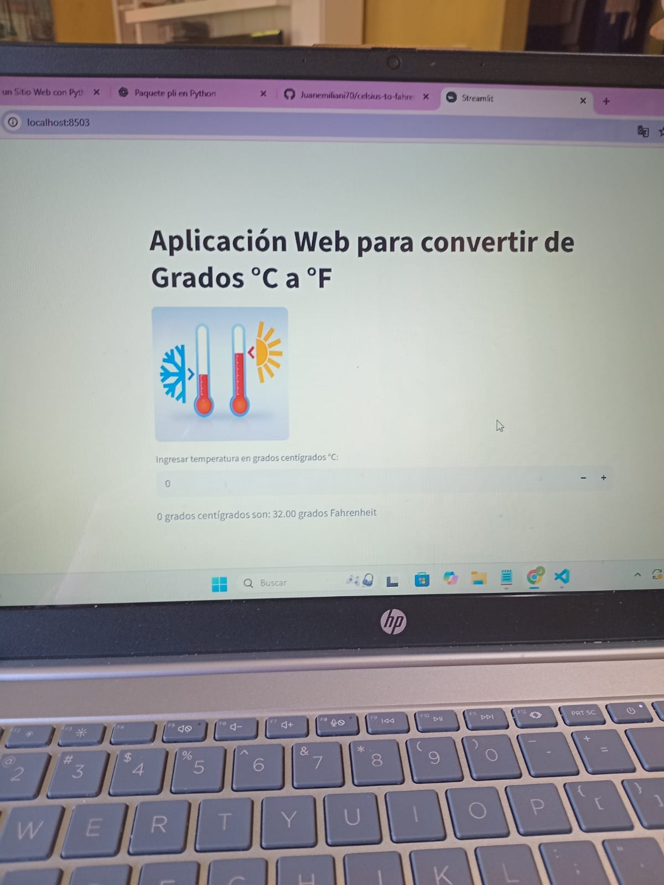

# Celsius to Fahrenheit Converter App

A simple **Streamlit** web application to convert temperatures from Celsius (°C) to Fahrenheit (°F).  
The app also displays images for a more engaging interface.

---

## Features

- Convert temperatures from °C to °F  
- Input only integers for temperature values  
- Display images (located in the `imagenes_app` folder)  
- User-friendly web interface using Streamlit  

---

## 🖼 Screenshots

  
  
  
  

---

## Installation

1. Clone the repository:  
```bash
git clone https://github.com/yourusername/celsius-to-fahrenheit-app.git

2. Navigate to the project folder:
cd celsius-to-fahrenheit-app

3. Install the required packages:
pip install streamlit pillow

4. Run the app with Streamlit:
streamlit run main.py
